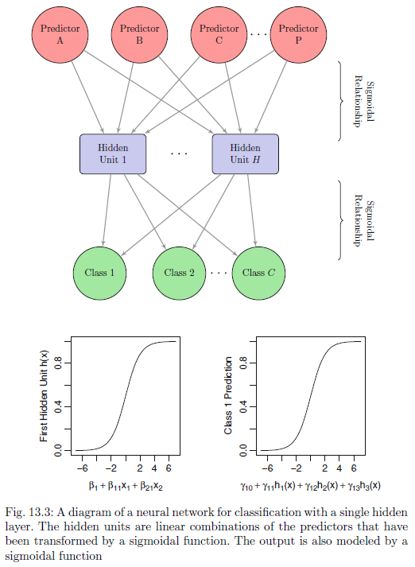

[return to [overview page](./hld_OVERVIEW.html)]

In this section, I will build a neural network model to make truth and lie predictions
on our statements. Such methods have seen a recent explosion in popularity, partly 
due to increases in the computational capacity of computers and the wider availability 
of massive amounts of data on which these models can more successfully be "trained"
(Thompson, 2018). In their widely used textbook, *The Elements of Statistical Learning*,
Hastie, Tibshirani, & Friedman (2009, p. 392) point out that despite the "hype" about neural networks,
which can make them seem "magical and mysterious", they are just another type of
nonlinear statistical model. The caret and nnet packages in R make the implementation
of at least basic neural networks very easy (Kuhn, 2008; Ripley & Venables, 
2016) -- so easy, in fact, that charlatans, like me, who have no business
using them, are nevertheless able to do so. So, out of reckless curiousity and 
simply because it is possible, I thought it would be interesting to give this 
type of modeling a shot.

Because it is possible to build a neural network in R without really understanding how
they work or what they are doing and because this is exactly what I will do below, it
was important to me that I somehow be punished for this. Thus, I begin by attempting
to explain and provide a brief overview of neural networks. I apologize to the reader
for what they will have to suffer through in the next few paragraphs, but the process
of writing them out proved so humiliating and infuriating that it felt like a 
partially sufficient punishment.

In broad terms, neural networks draw their inspiration from some basic features of the 
brain. They seek to provide mathematical and algorithmic descriptions of how sets of
(abstracted) neurons in the brain could coalesce to perform tasks like binary 
classification and image recognition. The fundamental units of neural networks are "nodes"
(which can be thought of as representing individual neurons), arranged into different
"layers". These layers are are sequentially connected through links between their
constituent nodes (each of these connections can be though of as a synapse).
An initial layer of input nodes eventually leads to a final layer of output nodes 
(with possible layers of nodes in between). Through some process of updating the weights 
attached to these links between nodes (which emulate the process of updating and changing the 
strength of synaptic connections; Hebb, 1949), learning of simple and sophisticated 
relationships can be simulated. The heart of neural network research is in exploring
different processes for how these synaptic connections may be updated to lead to
successful learning.

Historically, the origin of research on neural network models is often attributed 
to Warren McCullough and Walter Pitts (1943), for their paper "A logical calculus 
of the ideas immanent in nervous activity". A next major innovation came from Frank
Rosenblatt (1958) (of Cornell), in his paper on "the perceptron". As I understand it 
(which is to say, not well), perceptrons provided a simple model of how a single
layer of inputs neurons linked to an output neuron can be trained to perform 
basic tasks like binary classification, through various threshold functions which 
emulate the "activation" or non-activation of neurons. In 1969, Marvin Minsky and 
Seymour Papert, published a book *Perceptrons: an introduction to computational geometry*,
which showed the limitations of such basic perceptron models (and then went on to 
describe how these limitations could be overcome by linking together multiple 
perceptrons). Thus, later research expanded into networks with greater numbers of
intermediary layers. An important innovation came in the 1980s from Rumelhart, Hinton,
& Williams (1986), who developed a technique (back-propogation) which used methods
in calculus ("gradient descent") to allow for a computationally tractable method 
of "learning" and updating in multilayer networks. Recent research focuses on 
"deep" networks (i.e. networks with many layers) and networks where information can flow
in multiple directions, rather than just forward, making "loops" between different
layers in the process of learning and updating (these types of networks are referred
to as recurrent neural networks).

Here, we will implement a very simple type of neural network, enabled by the nnet
package -- a "feed-forward", neural network with a single hidden layer. 
Hastie, Tibshirani, & Friedman (2009, p. 392) refer to this as the "the 
most widely used 'vanilla' neural net". Because vanilla is delicious, I have no
problem with this.

Kuhn & Johnson (2013, p. 334) provide a graphical depiction of the basic structure
of a feedforward single hidden layer neural network. As we can see, there are three
fundamental components in this neural network:

* an input layer
* a hidden layer
* an output layer

When implementing a neural network to model our lie and truth data, the nodes of our
input layer will consist of the 90 predictor features we extracted earlier. The
output layer will consist of two nodes, one for of the classes our statements 
can fall into (lies and truths). Linking these two together will be a hidden layer.
The number of nodes in our hidden layer is a free parameter that we will have to
select a value for as before. (As with our [support vector machines models](./hld_MODEL_svm.html), 
this will be done through a process of model tuning.) The values of the nodes in
the hidden layer will be determined as linear combinations of the nodes (features)
in the input layer (as the authors depict, for example, a sigmoid function can
be used as the basis of this transformation). And likewise, the final classes will 
be predicted as a linear combination of the nodes in the hidden layer (Kuhn & Johnson, 2013; p. 333).
The modeling process will begin by assigning random weights to the connections 
between nodes, which are then iteratively updated as predictions are checked
against reality and error is back-propagated. In part because this back-propogation
process does not provide a "global solution" as other modeling techniques can be
proven to do, such models are susceptible to over-fitting. In attempt to deal with
this, another free parameter, weight decay, applies penalties in order to limit
such overfitting (Kuhn & Johnson, 2013; p. 143). This, along with the number of
nodes in the hidden layer is another parameter that we will have to tune in our
modeling. Lets now get to it.



# Packages

Let's make sure to load all the relevant packages.

```{r packages, message=FALSE, warning=FALSE}
# before knitting: message = FALSE, warning = FALSE
library(tidyverse) # cleaning and visualization
library(caret) # modeling
library(nnet) # for neural networks specifically (caret "nnet" wraps these functions)

```

# Load Data

Next, I will again load the pre-processed data, which we created earlier
(see [Data Cleaning & Pre-Processing](./hld_CLEAN.html)). As a reminder,
this dataset has a row for each of 5,004 statements, a column indicating whether 
that particular statement was a truth or a lie, and 90 possible predictor variables for 
each statement, which comes from the textual features we extracted earlier.

```{r load}
# load pre-processed df's
load("stats_proc.Rda")

# For rendering, I'm going to cheat here and load results created when this model was first run
# For some reason, chunks that were supposed to be caches when originally run are rerunning
load("results_neural.Rda")
results <- results_neural # change the specific named (renamed at end), back to generic name

```


# EXAMPLE (Neural Network)

As usual, let's begin with an example. We will conduct one training-testing
split and create and assess the performance of of one resultant support 
vector machine model, with a radial basis kernel function.

## Split Sample Into Training and Testing Sets

As with our [logistic regression models](./hld_MODEL_logistic.html), we will
conduct a 50-50 training-testing split, randomly allocating one half of the 
statements to the training set, and the other half to the testing set using the
createDataPartition function in the caret package (Kuhn, 2008).

```{r partition}
# set seed, so that statistics don't keep changing for every analysis
set.seed(2019)

# partition data in 50-50 lgocv split (create index for test set)
index_train_ex <- 
  createDataPartition(y = stats_proc$stat_id,
                      p = 0.50,
                      times = 1,
                      list = FALSE)

# actually create data frame with training set (predictors and outcome together)
train_set_ex <- stats_proc[index_train_ex, ]

# actualy create data frame with test set (predictors and outcome together)
test_set_ex <- stats_proc[-index_train_ex, ]

```

## Build Model (on Training Set)

Now that the data are split, we can train a neural network on our training data.
This is made almost trivially easy by the "train" function in the
the caret package (Kuhn, 2008; [Kuhn, 2019](https://topepo.github.io/caret/train-models-by-tag.html)),
which allows us to model our data using a single hidden layer feedforward
neural network by selecting the "nnet" model (a wrapper on the nnet function in
the [nnet](https://cran.r-project.org/web/packages/nnet/nnet.pdf) package
from (Ripley & Venables, 2016)).

As mentioned earlierr and as with with our 
[support vector machine model](./hld_MODEL_svm.html), we have two
free tuning parameters, which need to be set. These are (1) the number of nodes 
in the hidden layer and the (2) the value of the "weight decay" parameter.
(Note that weight decay is not the same as the "learning rate", which is a parameter in
earlier, simpler neural network models. It is my understanding that in neural network
models such as the one here the gradient descent method obviates the need to
select a "learning rate"; see discussion [here](https://stats.stackexchange.com/questions/29130/difference-between-neural-net-weight-decay-and-learning-rate)).

I will cycle through these number of hidden layer nodes: 1, 2, 3, 4, 5, and 10.
(The computational complexity of our model and the time it takes to run increases
massively as we add more layers; thus I will not explore models with large numbers,
like dozens and dozens, of hidden layer nodes). And I will cycle through decay rates of: 
0, 0.05, 0.1, 1, and 2 (which are the range of values that Kuhn & Johnson (2013, p. 361)
cycle through in their implementations of similar models). Thus, we will have cycle
through 30 different combinations of parameter values (6 different hidden layer 
candidate values times 5 different decay rate values).

As with our support vector machine model, we will select tuning parameter values
through a process of training and testing within our training set (again, using a
50-50 split, with 3 resamples for each of the 30 parameter combinations). (See
the "Build Model (on Training Set)" of the [SMV](./hld_MODEL_svm.html) page
for a more in depth discussion of how we implement this process.)

Thismodel tuning process is completed below, followed by a summary of our results.
As we can see in the textual output, the parameters that led to the best results
were a model with only one single node in the hidden layer, and a decay rate
value of 2 (which together led to an average accuracy rate of 59.7%). Thus, 
the neural network we will use will have its tuning parameters set to: number of 
nodes = 1, and decay rate = 2.

```{r neural_params}
# note: these setting chunks are separated for reuse later

# set seed, so that statistics don't keep changing for every analysis
set.seed(2019)

# -----------------------------------------------------------------------------
# STEP 1: SELECT TUNING PARAMETERS

# part a: set range of tuning parameters (layer size and weight decay)
tune_grid_neural <- expand.grid(size = c(1:5, 10),
                                decay = c(0, 0.05, 0.1, 1, 2))


# part b: set some other consrains to be imposed on network (to keep computation manageable)
# see: p. 361 of Kuhn & Johnson (2013, 
max_size_neaural <- max(tune_grid_neural$size)
max_weights_neural <- max_size_neaural*(nrow(train_set_ex) + 1) + max_size_neaural + 1

# -----------------------------------------------------------------------------
# STEP 2: SELECT TUNING METHOD
# set up train control object, which specifies training/testing technique
train_control_neural <- trainControl(method = "LGOCV",
                                     number = 3,
                                     p = 0.50)

```

```{r neural_ex, cache = TRUE}
# set seed, so that statistics don't keep changing for every analysis
# (applies for models which might have random parameters)
set.seed(2019)

# start timer
start_time <- Sys.time()

# -----------------------------------------------------------------------------
# STEP 3: TRAIN MODEL

# use caret "train" function to train svm
model_ex <- 
  train(form = grd_truth ~ . - stat_id,
        data = train_set_ex,
        method = "nnet",
        tuneGrid = tune_grid_neural,
        trControl = train_control_neural,
        metric = "Accuracy", # how to select among models
        trace = FALSE,
        maxit = 100,
        MaxNWts = max_weights_neural) # don't print output along the way

# end timer
total_time <- Sys.time() - start_time

```

```{r model_ex_print}
# print out overall summary for tuning process
model_ex

```

## Evaluate Model (on Testing Set)

Now that we have selected values for our two tuning parameters (number of nodes = 1, 
and decay rate = 2), let's build our full model and evaluate its peformance.
(Note again that that while we built and evaluated a model with these tuning parameters
earler, these were only built on subsets (i.e of ~1250 entries) of the training dataset and evaluated on
diferent subsets of that same training dataset (also of ~1250 entries). Now that
we have selected our tuning parameters, we want to build a model with those parameters
on the full training dataset (i.e. ~2500 entries) and evaluate its performance on
the original training set we put aside at the beginning (also of ~2500 entries)).

When we evaluate the performance of our tuned model on the holdout testing set, we
see that it performs well. Its overall accuracy was significantly better than 
chance: 60.4% [95% CI: 58.5, 62.4%]. And it performed well both in identifying 
truths (i.e. sensitivity: 61.2%) and identifying lies
(i.e. specificity: 59.7%). And when the model made a prediction that a statement
was a truth, it was correct more often than not (i.e. precision or positive predictive value:
60.3%). And when it made a prediction that a statement was a lie, it was also
correct more often than not (i.e. negative predictive value: 60.6%). (Confidence
intervals can easily be generated for these other four statistics as well (i.e. +/-
z\*(sqrt(p\*(1-p)/n), where z = 1.96; I won't calculate these for this example,
but I will do so below in our full analysis.)

```{r neural_ex_conf, cache = FALSE}
# note: https://stats.stackexchange.com/questions/52274/how-to-choose-a-predictive-model-after-k-fold-cross-validation
# which makes clear that we retrain our final model selected after turning on ALL the training data

# make predictions
preds_ex <-
  predict(object = model_ex,
          newdata = test_set_ex,
          type = "raw")
      
# record model performance
conf_ex <-
  confusionMatrix(data = preds_ex,
                  reference = test_set_ex$grd_truth,
                  positive = "truth")
      
# print confusion matrix
conf_ex

```

# FULL (Neural Networks)

Let's now repeated the process from above 10 times, and evaluate the average
performance of our neural network model across these 10 iterations.

## Run 10 models

Below is the code that runs through this modeling process 10 different times and
saves the result from each round.

```{r neural_full, cache = TRUE, eval = FALSE}
# -----------------------------------------------------------------------------
# STEP 0: set seed, so that statistics don't keep changing for every analysis
set.seed(2019)

# -----------------------------------------------------------------------------
# STEP 1: decide how many times to run the model
rounds <- 10

# -----------------------------------------------------------------------------
# STEP 2: set up object to store results
# part a: create names of results to store
result_cols <- c("model_type", "round", "accuracy", "accuracy_LL", "accuracy_UL",
                 "sensitivity", "specificity", "precision", "npv", "n")

# part b: create matrix
results <-
  matrix(nrow = rounds,
         ncol = length(result_cols))

# part c: actually name columns in results marix
colnames(results) <- result_cols

# part d: convert to df (so multiple variables of different types can be stored)
results <- data.frame(results)

# -----------------------------------------------------------------------------
# STEP 2: start timer
start_time <- Sys.time()

# -----------------------------------------------------------------------------
# STEP 3: create rounds number of models, and store results each time

for (i in 1:rounds){
  
  # part a: partition data in 50-50 lgocv split (create index for test set)
  index_train <- 
    createDataPartition(y = stats_proc$stat_id,
                        p = 0.50,
                        times = 1,
                        list = FALSE)
  
  # part b: create testing and training data sets
  train_set <- stats_proc[index_train, ]
  test_set <- stats_proc[-index_train, ]
  
  
  # part c: use caret "train" function to train logistic regression model
  model <- 
    train(form = grd_truth ~ . - stat_id,
        data = train_set_ex,
        method = "nnet",
        tuneGrid = tune_grid_neural,
        trControl = train_control_neural,
        metric = "Accuracy", # how to select among models
        trace = FALSE,
        maxit = 100,
        MaxNWts = max_weights_neural) # don't print output along the way
  
  # part d: make predictions
  preds <-
    predict(object = model,
            newdata = test_set,
            type = "raw")
  
  # part e: store model performance
  conf_m <-
    confusionMatrix(data = preds,
                    reference = test_set$grd_truth,
                    positive = "truth")
  
  # part f: store model results
  # model type
  results[i, 1] <- "neural"
  # round
  results[i, 2] <- i
  # accuracy
  results[i, 3] <- conf_m$overall[1]
  # accuracy LL
  results[i, 4] <- conf_m$overall[3]
  # accuracy UL
  results[i, 5] <- conf_m$overall[4]
  # sensitivity
  results[i, 6] <- conf_m$byClass[1]
  # specificity
  results[i, 7] <- conf_m$byClass[2]
  # precision
  results[i, 8] <- conf_m$byClass[3]
  # negative predictive value
  results[i, 9] <- conf_m$byClass[4]
  # sample size (of test set)
  results[i, 10] <- sum(conf_m$table)
  
  # part g: print round and total elapsed time so far
  cumul_time <- difftime(Sys.time(), start_time, units = "mins")
  print(paste("round #", i, ": cumulative time ", round(cumul_time, 2), " mins",
              sep = ""))
  print("--------------------------------------")

}

```

## View Results (Tabular)

Below, I've displayed a raw tabular summary of the results from each of the 10 models.
Unlike with our earlier logistic regression and support vector machine models, 
we see a great degree of variability from model to model
(e.g. our worst fit model has an overall accuracy of 60.0%, while our best fit model
has an accuracy that jumps to 75.4%). I believe this greater variability might be
a function of the fact tha neural network models do not find provably "global" solutions,
and thus may vary more from one model to another through the iterative process whereby the
initial random weight values are updated. However, this is only a guess and I would
be curious about the explanations of real experts.

```{r full_results}
results
  
```

## View Results (Graphically)

The average neural network performance across our the 10 iterations is plotted below,
where our five primary performance statistics are highlighted (accuracy, sensitivity,
specificity, precision and negative predictive value). All are significantly above
50% (and the point estimate for our average overall accuracy rate is over 65%).

```{r viz_full_results}
# calculate average sample size
mean_n <- mean(results$n)

# create df to use for visualization
results_viz <-
  results %>%
  group_by(model_type) %>%
  summarize(accuracy = mean(accuracy),
            sensitivity = mean(sensitivity),
            specificity = mean(specificity),
            precision = mean(precision),
            npv = mean(npv)) %>%
  select(-model_type) %>%
  gather(key = "perf_stat",
         value = "value") %>%
  mutate(value = as.numeric(value))

# actual visualization
ggplot(data = results_viz,
  aes(x = perf_stat,
           y = value)) +
geom_point(size = 2,
           color = "#545EDF") +
geom_errorbar(aes(ymin = (value - 1.96*sqrt(value*(1-value)/mean_n)),
                   ymax = (value + 1.96*sqrt(value*(1-value)/mean_n))),
              color = "#545EDF",
              width = 0.15,
              size = 1.25) +
geom_hline(yintercept = 0.5,
           linetype = "dashed",
           size = 0.5,
           color = "red") +
scale_y_continuous(breaks = seq(from = 0, to = 1, by = 0.05),
                   limits = c(0, 1)) +
scale_x_discrete(limits = rev(c("accuracy", "sensitivity", "specificity", 
                            "precision", "npv"))) + 
coord_flip() +
theme(panel.grid.major.x = element_line(color = "grey",
                                        size = 0.25),
      panel.grid.minor.x = element_blank(),
      panel.grid.major.y = element_blank(),
      panel.background = element_blank(),
      axis.ticks = element_blank(),
      plot.title = element_text(hjust = 0.5),
      axis.title.y = element_text(margin = 
                                    margin(t = 0, r = 10, b = 0, l = 0)),
      axis.title.x = element_text(margin = 
                                    margin(t = 10, r = 00, b = 0, l = 0)),
      axis.text.x = element_text(angle = 90)) +
labs(title = "Performance Statistics (Neural Network)",
     x = "Performance Statistic",
     y = "Proportion (0 to 1)")


```

# Save Results

Finally, we can save our results and we are done.

```{r save, eval = FALSE}
# rename results df, to be particular to this model type (for disambiguation later)
results_neural <- results

# clear results variable
rm(results)

# save results in Rda file
save(results_neural,
     file = "results_neural.Rda")
```

# Render

If needed, I can render with rmarkdown::render("hld_MODEL_svm.Rmd").

# Citations

* Hastie, T., Tibshirani, R., & Friedman, J. (2009). The elements of statistical
learning: data mining, inference, and prediction, Springer Series in Statistics.
Springer New York.

* Hebb, D. (1949). The Organization of Behavior.

* Kuhn, M. (2008). Building predictive models in R using the caret package.
Journal of Statistical Software, 28(5), 1-26.

* Kuhn, M., & Johnson, K. (2013). Applied predictive modeling (Vol. 26). Springer.

* McClelland, J. L., & Rumelhart, D. E. (1986). Parallel distributed processing.
Explorations in the Microstructure of Cognition, 2, 216-271.

* McCulloch, W. S., & Pitts, W. (1943). A logical calculus of the ideas immanent
in nervous activity. The Bulletin of Mathematical Biophysics, 5(4), 115-133.

* Minsky, M., & Papert, S. (1969). Perceptrons: an introduction to computational
geometry.

* Ripley, B., & Venables, W. (2016). nnet: Feed-Forward Neural Networks and 
Multinomial Log-Linear Models (Version 7.3-12). Retrieved from 
https://CRAN.R-project.org/package=nnet

* Rosenblatt, F. (1958). The perceptron: a probabilistic model for information
storage and organization in the brain. Psychological Review, 65(6), 386.

* Rumelhart, D., Hinton, G., & Williams, R. (1986). Learning Representations 
by Back-Propagating Errors. Nature, 323, 533-536.

* Thompson, N. (2018, May 13). An AI Pioneer Explains the Evolution of Neural Networks.
Wired. Retrieved from https://www.wired.com/story/ai-pioneer-explains-evolution-neural-networks/

# END
