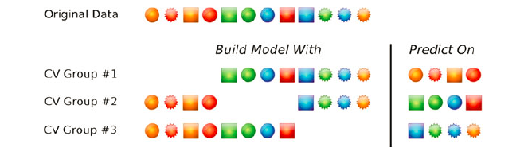
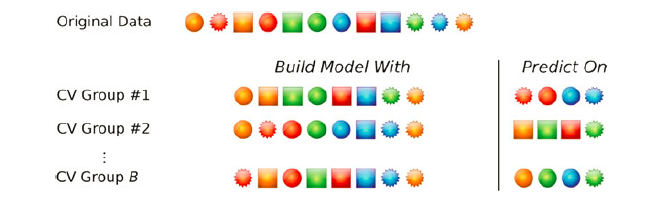
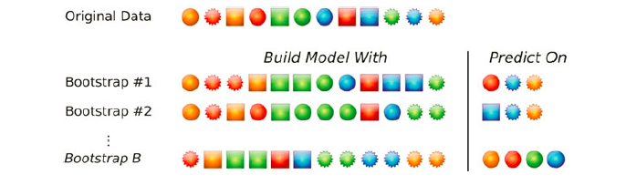

[return to [overview page](./hld_OVERVIEW.html)]

Now that we have extracted various features (sentiment, parts of speech,
indvidual word counts) and these features have been cleaned, we are ready to use them 
to build statistical models that can make binary predictions about whether individual 
statements are truths or lies. Because these models will differ from each other
(e.g. logistic regression v. neural nets), it is important to identify common
criteria by which the performance of these different models can be assessed and thus
compared. In this section my aim is to provide an overview of how we will 
assess model performance.

At a very high level, our modeling process will have two basic components. First,
we build the model ("model training"). Second, we assess its performance ("model 
testing"). 

(The model should be trained on separate data from the data it is tested on.
In the final part of this section, "Data Splitting, for Model Training and Testing", 
we will review various strategies for splitting a dataset into portions for testing 
and training. For now, assume we have done this correctly and are at the model "testing" phase.)

The setup for model testing will always be the same. We will have a set
of statements (from which various textual features have been extracted),
our "testing set". For each statement in this testing set, the model will be fed 
the value of the features for that statement (e.g. statement length, sentiment score),
and it will spit out a prediction for each of those statements. We can then compare these 
predictions to reality.
Most obviously, we can look at overall accuracy (# correct predictions / #
of predictions). But other important metrics exist as well: sensitivity, specificity,
precision, and negative predictive value. I review these below, using example data.

(Note, this is all occuring in the domain of "binary classification", and "classification"
more generally. Models that perform classification aim to predict membership of items in
discrete categories or "classes". Here, we are predicting whether a statement belongs in the class 
"lies" or the class "truths". Other binary classification tasks might including predicting
a whether a person will or will not default on a loan based on 
their previous financial history. Not all classification tasks are binary; for example, 
one might try to build
a model that takes in images of animals and uses features extracted from those images,
to predict what species of animal is in those pictures, e.g. dog, cat, elephant. And
finally, an entirely different domain of prediction involves making predictions about
continuous quantities, e.g. predicting someone's expected salary based on features like
their education and previous employment history. Different metrics, like root mean
squared error, are used to assess the performance of models that make predictions
about continuous quantities. These are not covered here.)

(Interestingly, the metrics we will review for assessing model performance in our
binary classification task can (and will) also be used to quantify human lie
detection performance.)


# Packages

As usual I wil start with the house-keeping matter of loading some packages that
will be used in this section.

```{r, message=FALSE, warning=FALSE}
# before knitting: message = FALSE, warning = FALSE
library(tidyverse) # cleaning and visualization
library(ggthemes) # visualization

```

# Confusion Matrix

We will focus on five key performance statistics (overall accuracy, sensitivity,
specificity, precision, and negative predictive value). All of these statistics
can be derived from a table that is central to evaluating performance in binary
classification. This table is called a "confusion matrix" and is a 2x2 table that
cross-tabulates predictions and actual outcomes (I use the terms "actual outcomes"
and "reality" interchangeably throughout).

For any other binary classification task, we can imagine we are trying to
identify one of the two classes, which we refer to as "positive" cases. For example,
in our present task, we might take the perspective that we are trying to identify
which statements are true statements and call these our positive cases (making lies
our "negative" cases). Thus, when we compare predictions to reality in binary classification
there are only four possible outcomes: a positive case is correctly identified
as a positive case (a "true positive"), a positive case is incorrectly identified
as a negative case (a "false negative"), a negative case is correctly identified
as a negative case (a "true negative"), and a negative case is incorrectly identified
as a positive (a "false negative"). A confusion matrix simply counts up the
number of times each of these four types of events happen.

A generic example is shown below for how this confusion matrix would be filled out
once predictions are made on set of statements in our datset.

. | Prediction = Truth | Prediction = Lie
--------------- | --------------- | --------------
Reality = Truth | # True Positives | # False Negatives
Reality = Lie | # False Positives  | # True Negatives

To make things a little more concrete, imagine that we had a set of 100 statements, 
50 of which are true, and 50 of which are lies. And we made a prediction about each of them,
with the end result being 40 true statements correctly identified as true, 10 true statements 
incorrectly identified as lies, 30 lies correctly identified as lies, and 20 lies incorrectly
identified as truths. Our resultant confusion matrix would look like the following.

. | Prediction = Truth | Prediction = Lie
--------------- | --------------- | --------------
Reality = Truth | 40 | 10
Reality = Lie | 20 | 30

# Performance Metrics

We can also display this information visually, and use this to walk through
the binary classification performance metrics.

## Generate Example Data

To do this, first, let's generate some example data (with the same distributions of
40 true positives, 10 false negatives, 30 true negatives, and 20 false negatives).

```{r}
# make matrix of the right shape
example <-
  matrix(ncol = 4,
         nrow = 10 * 10)

# name columns
colnames(example) <- c("x_cord", "y_cord", "Reality", "Prediction")

# convert to data frame
example <- data.frame(example)

# fill in values
counter = 0
for (y in 1:10){
  for (x in 1:10) {
    counter = counter + 1
    example[counter, 1] <- x
    example[counter, 2] <- y
    if (y <= 5) {
      if (x <= 8) {
        example[counter, 3:4] <- c("Truth", "Truth")
      } else if (x > 8) {
        example[counter, 3:4] <- c("Truth", "Lie")
      }
    } else if (y > 5) {
      if (x <= 6) {
        example[counter, 3:4] <- c("Lie", "Lie")
      } else if (x > 6) {
        example[counter, 3:4] <- c("Lie", "Truth")
      }
    }
  }
}

# make variable to denote correct and incorrect responses
example <-
  example %>%
  mutate(correct = case_when(Reality == Prediction ~ "Correct",
                             Reality != Prediction ~ "Incorrect"))

# print resulting df (turned off for knitting)
# example
```

## Visualize Example Data

In the visualization below, each of the 100 statements is visualized by an individual
box (numbered in the upper right hand corner from 1 to 100). The color of box represents
the underlying "reality" with regard to each statement (green boxes represent truthful 
statements, and red boxes represent lies). The colored circles "within" these boxes 
represent our predictions for each statment (green circles represent statements predicted
to be truthful, and red circles represent statements predicted to be lies). We can
compare reality to our predictions by compared the color of the box to the circles
within them. If the colors match (e.g. green box with green circle in it), our prediction
was correct; if the colors don't match (e.g. green box with red circle in it), our
prediction was wrong. To make this clear, an X is placed through a box it if our 
prediction was incorrect, and a plus-sign is placed through a box if our prediction was correct.
Let's now walk through the key performance metrics.

```{r, fig.width=8, fig.height=5}
# make plot
pred_plot <-
ggplot(data = example,
       aes(x = x_cord,
           y = y_cord)) +
  geom_point(aes(color = Reality),
             shape = 15, # full square
             size = 11) +
  scale_color_manual(values = c("#de2d26", "#2ca25f")) + # set custom color colors 
  geom_point(aes(fill = Prediction),
             shape = 21, # outlined circle
             color = "transparent",
             size = 5) +
  scale_fill_manual(values = c("#930000", "#276b1c")) + # set custom fill colors
  geom_point(aes(shape = correct),
             size = 11,
             color = "white",
             position = position_nudge(x = 0, y = -0)) + # x = 0.1, y = -0.2
  scale_shape_manual(values = c(3, 4)) + # set custom shape shapes
  geom_text(aes(label = 1:100),
            size = 3,
            hjust = 1,
            vjust = -0.5,
            color = "white") +
  labs(title = "Reality v. Predictions",
       y = "",
       x = "") +
  scale_y_continuous(breaks = seq(from = 10, to = 0, by = -1),
                     trans = "reverse") +
  scale_x_continuous(breaks = seq(from = 0, to = 10, by = 1),
                     position = "top") +
  guides(color = guide_legend(order = 1),
         fill = guide_legend(order = 2),
         shape = guide_legend(order = 3,
                              title = NULL,
                              label = FALSE)) +
  theme(plot.title = element_text(hjust = 0.5),
        panel.grid.major = element_blank(),
        panel.grid.minor = element_blank(),
        panel.border = element_blank(),
        panel.background = element_blank(),
        axis.text.x=element_blank(),
        axis.ticks.x=element_blank(),
        axis.text.y=element_blank(),
        axis.ticks.y=element_blank(),
        legend.key = element_rect(color = "transparent", fill = "transparent"),
        legend.position = "right",
        legend.title.align = 0.5,
        legend.box.margin=margin(t = 0, b = 0, r = 10, l = 0))

# print plot (with overall accuracy highlighted)
pred_plot

```

## Overall Accuracy

Let's start with the most basic metric of performance -- overall accuracy. 
In our diagram, overall accuracy is the sum of all our correct predictions (the
boxes with a plus sign) divided by our total number of predictions (the boxes
with a plus sign plus the boxes with an X). Here that gives us 70% overall accuracy.

Mathematically, overall accuracy can also be thought of as: 

$$\frac{\sum_{}^{}TRUEpositive + \sum_{}^{}TRUEnegative}{\sum_{}^{}TRUEpositive + \sum_{}^{}TRUEnegative + \sum_{}^{}FALSEpositive + \sum_{}^{}FALSEnegative}$$
For our example data, this calculation is also depicted in the figure below. The total number of boxes within 
the border of the solid black lines correspond the numerator in the equation above (70),
and the total number of boxes within the border of the dotted black lines represent 
the denominator (100).

```{r, fig.width=8, fig.height=5}
# print plot (with overall accuracy highlighted)
pred_plot +
  geom_rect(aes(xmin = 0,
                xmax = 11,
                ymin = 0,
                ymax = 11),
            fill = "transparent",
            color = "black",
            linetype = "dotted") +
  geom_rect(aes(xmin = 0.25,
                xmax = 8.5,
                ymin = 0.25,
                ymax = 5.4),
            fill = "transparent",
            color = "black",
            linetype = "solid") +
  geom_rect(aes(xmin = 0.25,
                xmax = 6.5,
                ymin = 5.5,
                ymax = 10.8),
            fill = "transparent",
            color = "black",
            linetype = "solid")

```

## Sensitivity ("Truth Detection Rate")

Another useful meric by which classification models are assessed is sensitivity
(also called "recall"). Sensitivity is the percent of all "positive" outcomes
that we actually detect. Here is an example. When we put our luggage through the 
x-ray machine at the airport, we can imagine that the machine is trying to
detect whether our luggage has a gun in it or not (presence of a gun is a "positive" case).
Sensitivity is the percent of all guns in suitcases that the x-ray machine actually finds. 
Such a machine could have very good overall accuracy simply by guessing that no one has
a gun in their suitcase -- because the vast majority of people don't have guns in their suitcases.
However, such a model would have poor sensitivity (in fact 0% sensitivity) because
it would detect 0% of the suitcases that do have guns in them. 

In our case, what sensitivity means depends on how we define our "positive" cases. 
If our task is "truth detection" (i.e. truth are "positive" cases), then sensitivity is the percent 
of all true statements that we correcntly predict to be true. In the figure, this 
is the sum of the green boxes with a green circle in them, divided
by all the green boxes (both those with a green circle in them and those with a 
red circle in them). Here, that gives us 80%. (If our task were "lie detection" (i.e. lies
were considered positive cases), then sensitivity would be
the percent of all lies that we correctly identify as lies (red boxes with a 
red dot in them, divided by all red boxes). Unless stated otherwise,
in this report, truths will always be considered "positive cases". And thus
sensitivity will correspond to a task of "truth detection" (i.e. truths are positive cases).)

Thus, in this particular case, we can think of sensitivity as the "truth
detection rate" -- the percent of all true statements that we correctly identify as true.

Mathematically, sensitivity is: 

$$\frac{\sum_{}^{}TRUEpositive}{\sum_{}^{}TRUEpositive + \sum_{}^{}FALSEnegative}$$

Again, for our example data, this calculation is also depicted in the figure. The total number of boxes within 
the border of the solid black lines correspond the numerator in the equation above (40),
and the total number of boxes within the border of the dotted black lines represent 
the denominator (50).


```{r, fig.width=8, fig.height=5}
pred_plot +
  geom_rect(aes(xmin = 0,
                xmax = 11,
                ymin = 0,
                ymax = 5.5),
            fill = "transparent",
            color = "black",
            linetype = "dotted") +
  geom_rect(aes(xmin = 0.25,
                xmax = 8.5,
                ymin = 0.25,
                ymax = 5.4),
            fill = "transparent",
            color = "black",
            linetype = "solid")
```


## Specificity ("Lie Detection Rate")

Specificity is the other side of the coin, in a sense, of sensitivity.
Specificity is the percent of all "negative" cases that a model correctly identifies.
To continue with the X-ray machine example from above (where the task is "gun detection"
in suitcases), specificity is the percent of all suitcases that do not have a gun, which we
correctly identified as not having a gun. Again, if we turn off the X-ray
machine and simply predict that no one has a gun, this "model" would have
great (in fact, perfect, 100%) specificity. (Of course, to the detriment
of sensitivity. Without perfect information, there is a tradeoff
between sensitivity and specificity. We are always between the extremes
of being overbroad and identifying everything as a positive case, thus achieving
high sensitivity at the cost of low specificity, or being overly conservative erring on
the side of not identifying anything as a positive case, thus achieving high specificity
at the expensive of low sensitivity. This tradeoff can be depicted with the use of
ROC curves, although I will not go into that here.) 

In our case, if our task is "truth detection" (identifying true statements), 
then specificity is the proportion of all lies
that we correctly identify as lies. Thus, here we can think of specificity as 
the "lie detection rate" of our model. For our example data of 100 statements that
we can have been working with this would be the 60% (the red boxes with
a red dot, divided by all the red boxes).

Mathematically, specificity is:
$$\frac{\sum_{}^{}TRUEnegative}{\sum_{}^{}TRUEnegative + \sum_{}^{}FALSEpositive}$$

Again, for our example data, this calculation is also depicted in the figure. The total number of boxes within 
the border of the solid black lines correspond the numerator in the equation above (30),
and the total number of boxes within the border of the dotted black lines represent 
the denominator (50).

```{r}
pred_plot +
  geom_rect(aes(xmin = 0,
                xmax = 11,
                ymin = 5.5,
                ymax = 11),
            fill = "transparent",
            color = "black",
            linetype = "dotted") +
  geom_rect(aes(xmin = 0.25,
                xmax = 6.5,
                ymin = 5.6,
                ymax = 10.8),
            fill = "transparent",
            color = "black",
            linetype = "solid")
```

## Precision ("Non-Gullibility")

In a sense, the previous metrics focused on outcomes. That is, we looked at metrics
that assessed how well our model could identity positive cases (sensitivity, e.g. "truths")
or how well our model could identify negative cases (specificity, e.g. "lies").
These next two metrics are more focused on predictions. The first such metric I will
explain is "precision" (also called positive predictive value). Most simply,
this can be thought of as the percent of times that a model is correct
when it predicts a "positive" outcome. To continue with the x-ray machine example,
it is the percentage of times that, after the machine beeps (predicts a suitcase
has a gun), that suitcase actually has a gun. 

In our case, assuming our task is
"truth detection", it is the percent of the time that a statement is true given
that we've predicted the statement is true. It can be thought as measuring a model's
"non-gullibility". If someone is not gullible, then they have high precision (a large
proportion of the statements they predict to be true are in fact true). In the
figure below for our example data, precision, is the sum of all green boxes with a
green circle in them divided by all boxes which have a green circle in them (66.7%).

Mathematically, precision is:

$$\frac{\sum_{}^{}TRUEpositive}{\sum_{}^{}TRUEpositive + \sum_{}^{}FALSEpositive}$$

Again, for our example data, this calculation is also depicted in the figure.
The total number of boxes within the border of the solid black lines correspond 
the numerator in the equation above (40),
and the total number of boxes within the border of the dotted black lines represent 
the denominator (60).

```{r}
pred_plot +
  geom_rect(aes(xmin = 0,
                xmax = 8.5,
                ymin = 0,
                ymax = 5.5),
            fill = "transparent",
            color = "black",
            linetype = "dotted") +
  geom_rect(aes(xmin = 6.5,
                xmax = 11,
                ymin = 5.5,
                ymax = 11),
            fill = "transparent",
            color = "black",
            linetype = "dotted") +
  geom_rect(aes(xmin = 0.25,
                xmax = 8.4,
                ymin = 0.25,
                ymax = 5.4),
            fill = "transparent",
            color = "black",
            linetype = "solid")
```


## Negative Predictive Value ("Well-Founded Skepticism")

Again, there is another side of the coin to the precision metric, as there
was for the sensitivity metric. Negative predictive value is, in a sense,
the other side of the coin of precision. It measures of the percent of
cases that are labeled as "negative" which are true negatives. In the x-ray example,
it is the proportion of times when a suitcase does not set off the machine's alarm
that the suitcase actually does not have a gun in it. 

In our case, 
assuming again our task is "truth detection", negative predictive value is the proportion
of statements that we predict to be lies which are actually lies. Negative predictive
value can be thought of as "well-founded skepticism". If someone is high
in well-founded skepticism (negative predictive value), a large portion of the
statements they believe to be lies turn out in fact to be lies. In the figure
below, negative predictive value is the total number of red boxes that also have
a red circle in them divided by the total number of boxes with a red circle in them
(75%).

Mathematically, negative predictive value is:

$$\frac{\sum_{}^{}TRUEnegative}{\sum_{}^{}TRUEnegative + \sum_{}^{}FALSEnegative}$$

Again, for our example data, this calculation is also depicted in the figure.
The total number of boxes within the border of the solid black lines correspond 
the numerator in the equation above (30),
and the total number of boxes within the border of the dotted black lines represent 
the denominator (40).

```{r}
pred_plot +
  geom_rect(aes(xmin = 8.5,
                xmax = 11,
                ymin = 0,
                ymax = 5.5),
            fill = "transparent",
            color = "black",
            linetype = "dotted") +
  geom_rect(aes(xmin = 0,
                xmax = 6.5,
                ymin = 5.5,
                ymax = 11),
            fill = "transparent",
            color = "black",
            linetype = "dotted") +
  geom_rect(aes(xmin = 0.25,
                xmax = 6.4,
                ymin = 5.6,
                ymax = 10.75),
            fill = "transparent",
            color = "black",
            linetype = "solid")
```


## Other performance metrics

There are a host of other important metrics and tools to assess classification performance,
which I will not discuss for the time being -- but are nevertheless useful and 
provide insight into a model's performance. Lest I fail to mention them entirely,
these include:

* Kappa
* F1 scores
* ROC curves
* AUC (area under the curve)
* Calibration Plots

# Data Splitting, for Model Training and Testing

The golden rule in predictive modeling is to never use the same data that the model 
was built on to assess the model's performance. All of the above has presupposed that 
we have already trained ("fit") a model on a certain portion of a dataset and are 
now using that model to make predictions on a different portion of the dataset. 
However, there are actually many different strategies for how to split the data 
into training and test sets. The most popular of these tend to fall into one of
these three categories (Kuhn & Johnson, 2013, Chapter 4):

* k-fold cross validation
* repeated training/testing splits
* bootstrapping

Each of these provide a different process for repeated splitting up a dataset
into training and testing portions, and evaluating the performance of a model
over and over.

## K-fold cross validation

In k-fold cross validation, we divide our entire data set into mutually exclusive
(disjoint) sets. If we divide the dataset into k different portions, then we
conduct k number of rounds of training and testing. In each of these rounds,
we hold out 1 portion of data for testing the model and use the remaining k-1
sections for training. This is repeated k times, which each 

For example, we can imagine a dataset with 100 rows. In 10-fold cross validation,
we would divide this dataset into 10 different junks: chunk 1 (consisting of 10 rows),
chunk 2 (consisting of a different 10 rows), chunk 3 (consisting of yet another
set of 10 rows), and so on up until chunk 10, whereupon each of our 100 observations
will be in one of the 10 chunks. (Usually, allocation to chunks is done through
randomization.) Then, in the first round of model building, we could fit a model 
to chunks 1-9 combined, and test the performance of that model by making predictions
on chunk 10. In the next round, we could fit a model to chunks 1-8 & 10 combined, 
and test the performance of that model by making predictions on chunk 9. In round 
after that, we could fit a model to chunks 1-7 & 9-10 combined, and then test the 
performance of that model by making predictions on chunk 8. And so on, until we
have done this 10 times (each of the 10 chunks will have been used as a testing
set once). (A very common type of k-fold cross validation is indeed 10-fold cross
validation.)

A key feature of k-fold cross validation is that across our k rounds of training
and training, none of the rows that are used in one round of testing will ever be 
used again in another round of testing. This is depicted below in a figure from
(Kuhn & Johnson, 2013, p.71). They depict a hypothetical dataset consisting of
12 observations ("rows" in my terminology). We then see how model training and
testing proceeds in a case of 3-fold cross validation on this dataset. In the first
round, the first chunk of the data is used as the testing set and the remaining
two chunks are used for training. In the next round, the second (middle) chunk
of the data is used as the testing set and the remaining two chunks are used for
training. And in the third and final round, the third (last) chunk of the data
is used as the testing set and the other two chunks are used for training. In
each of these rounds (assuming we are doing binary classification), we could extract 
the metrics 5 metrics reviewed above (overall accuracy, sensitivity, specificity,
precision, and negative predictive value). We could also look at average peformance
on these 5 metrics across the k rounds.



## Repeated training/testing splits

Another way of conducting k round of training and testing is by employing a
training-testing strategy alternatively referred to as repeated training/testing
splits, "leave-group-out crossvalidation", or or "Monte Carlo cross-validation"
(Kuhn & Johnson, 2013, p.71). This is very similar k-fold cross validation,
except we randomly generate our training and testing sets for each of our k
training and testing rounds. In each round, we pick a portion of our data'that
we want to be in training set and a portion of our data that we want to be in
our testing set (e.g. 90% training, 10% testing). In each round, we then randomly 
sample rows without replacement to determine which rows will be in our training
set and which will be in our testing set. As with k-fold cross validation, these
means that, in any given round, a row will never appear in both our training
and testing set. However, unlike k-fold cross validation, this does allow that
across different training and testing rounds, a row that appeared in a testing
set in one round may appear again in the testing set used in another round.
Again, this is depicted schematically by Kuhn & Johnson (2013, p.72) in the figure
below. Using the same hypothetical dataset of 12 rows, they show how 3 rounds of
repeated training/testing split would proceed. In each round, the portion of the
dataset used for training is 66.6% (i.e. 8/12), with the remaining data used in
the testing set. However, these are now determined by random sampling without
replacement--and thus datapoints can reappear in testing sets (e.g. we see
spiky green circle in the testing set in both rounds 2 and 3).



## Bootstrapping

The final major data splitting strategy is bootstrapping. It is almost exactly like the
"Monte Carlo cross-validation" reviewed just above, except that in each training-testing
round, rows are sampled *with* replacement. Bootstrapping is often used in cases where the dataset does not
contain that many observations. In these cases, methods like k-fold cross validation
or "Monte Carlo cross-validation", limit the amount of data that can be used for training
because the dataset is always split up, with only some portion of the full dataset going
into the training set. With bootstrapping, in each round of training and testing,
some portion of the observations are selected to create the training set and the other
portion is used to create the testing set. However, observations are sampled
with replacement both to create the training set and the testing set. Thus, the
same observation might appear multiple times in the training set or multiple
times in the training set. This allows us to build larger training sets that we might
otherwise be able to. And indeed with bootstrapping, the rows selected for the training
set are resampled with replacement until the training set is the same size as the original
dataset (Kuhn & Johnson, 2013, p.72).

This process is depicted  below in the figure from Kuhn & Johnson (2013, p.73). Again,
we have 3 rounds of training and testing. In each round, we construct the training
set by sampling with replacement from a subset of the rows of the full dataset. 
The rows which were not resampled from are used for the training set. Thus, as we
can see, we can construct testing sets that are of the same size as the full dataset,
even as the testing
set remains some portion of the size of the full dataset (e.g. around 33% here).
As we can also see, this results in the same datapoint not only appearing in test
sets between rounds (e.g. blue spiky ball appears in test set in both round 1 and
round 2), but also the same datapoint reappearing multiple times within one
trainig set (e.g. the green square appear twice in the training set in the first
round).



## Procedure For Our Models

When I evaluate various models that I will create in later sections, I will keep 
the method of data splitting constant. Specifically, I will always used a repeated 
training/testing splits ("Monte Carlo cross-validation"). To assess overall performance,
I will conduct 10 rounds of testing and training. In each round, the dataset will be
split exactly in half (i.e. 50-50 split). Using random sampling without replacement,
one half of the dataset will be used for the training set and the other half will
be used for the testing set. For final model evaluation, the average performance across 
these 10 models will be recorded. And this will consitute the official performance
of that model type. 

I prefer this technique for a few reasons. First, we have a fairly large amount of
data (5,004 rows). So we have enough data to "spare" that we don't *have to* use
bootstrapping if we don't want to. Even though bootstrapping is a perfectly legitimate
technique for data splitting, I'd like to avoid using the same observation multiple
times if we can in the training set if. That leaves a choice between k-fold cross 
validation and repeated testing/training splits ("Monte Carlo cross-validation").
I choose the latter strategy because
I'd like to allocate exactly equal amounts of data to the training set and the
testing set. With k-fold cross validation this is only possible if we conduct
2-fold cross validation (with 2 chunks, and 2 rounds of training and testing).
With "Monte Carlo cross-validation", we can conduct arbitrarily many rounds of
training-testing, with a 50-50 split each time -- because in each round, we are
sampling from the full dataset anew (rather than re-arranging the same sets of
chunks across rounds).

# Citations

These are some very useful resources to understanding some of the ways that
classification performance can be assessed.

* Sensitivity and specificity. (2018). In Wikipedia.
Retrieved from https://en.wikipedia.org/w/index.php?title=Sensitivity_and_specificity&oldid=868941362

* Confusion matrix. (2018). In Wikipedia.
Retrieved from https://en.wikipedia.org/w/index.php?title=Confusion_matrix&oldid=865598510

* Kuhn, M., & Johnson, K. (2013). Applied predictive modeling (Vol. 26). Springer.
(see Chapter 11: Measuring Performance in Classification Models &
Chapter 4: Overfitting and Model Tuning)

# END

